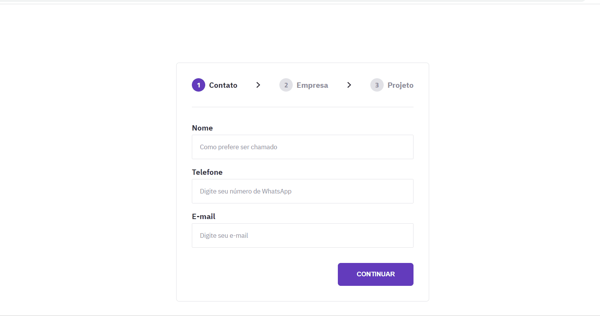

<h1 align="center"> Formulário Multi Step </h1>

 

  

## 🚀 Tecnologias

Esse projeto foi desenvolvido com as seguintes tecnologias:

- HTML e CSS
- JavaScript
- Git e Github

## 💻 Projeto

Desafio do #BoraCodar da Rocketseat consistia em fazer um formulário com validação de dados utilzando HTML, CSS e JS incrementando animações (em CSS e JS). O layout do projeto com as medidas foi apresentado através do Figma (o link está no arquivo txt).

## 🔖 Dasafios

- Reproduzir o layout do Figma em códigos
- Fazer as animações em CSS e JS

---